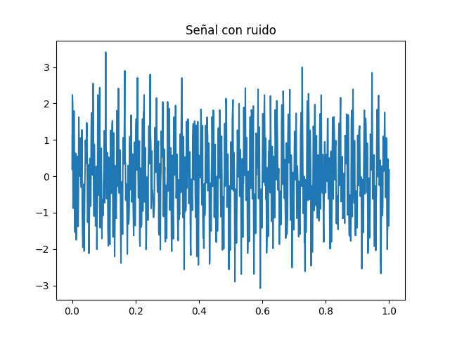
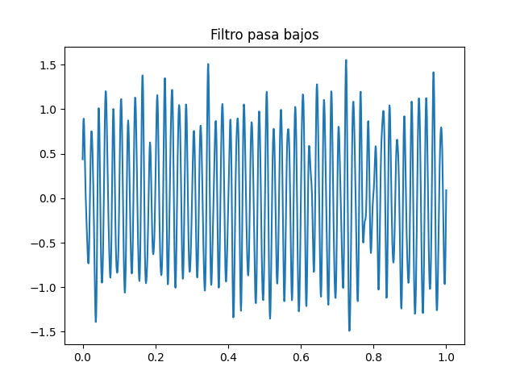
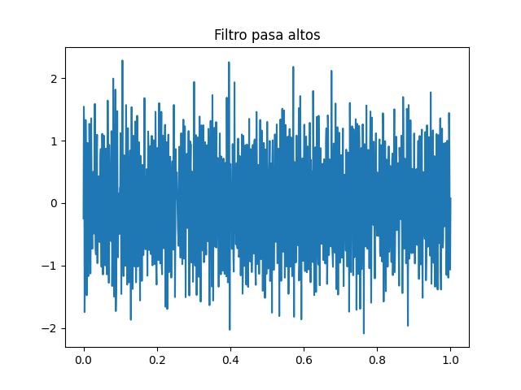
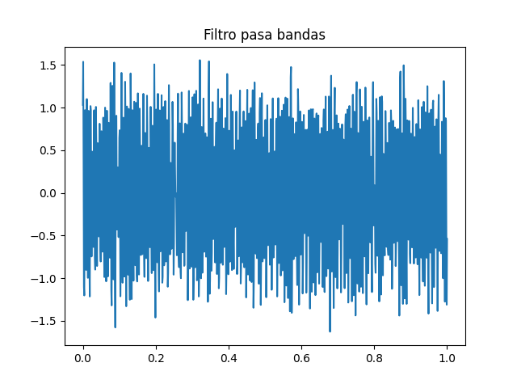

# Implementación de Filtros Digitales en Python

Este proyecto consiste en el diseño e implementación de filtros digitales (pasa bajos, pasa altos y pasa bandas) utilizando Python. Se trabajó con señales de prueba compuestas por varias frecuencias y se añadió ruido para analizar la efectividad de los filtros.

---

## Descripción del proyecto

1. **Señal de prueba**: combinación de 50 Hz y 200 Hz, con ruido aleatorio.
2. **Filtros aplicados**:
   - **Pasa bajos**: elimina las frecuencias altas y conserva las bajas.
   - **Pasa altos**: elimina las frecuencias bajas y conserva las altas.
   - **Pasa bandas**: permite solo un rango específico de frecuencias, eliminando las demás.

---

## Gráficas obtenidas

### Señal con ruido

### Filtro pasa bajos

### Filtro pasa altos

### Filtro pasa bandas

---

## Tecnologías utilizadas

- Python
- NumPy
- Matplotlib

---

## Autor

Jesus Angel Amaro Guerra